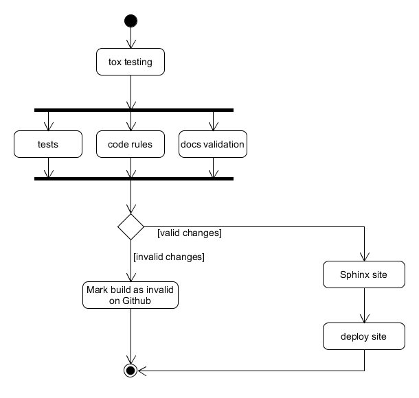

# Continuous Integration

## Travis

Continuous Integration is handled through [Travis CI](https://travis-ci.org/).

### Status flags

A few flags, stored in environmental variables, are used to control the CI flow. These are required by the [CI scripts](https://github.com/Bernardo-MG/ci-shell-scripts).

